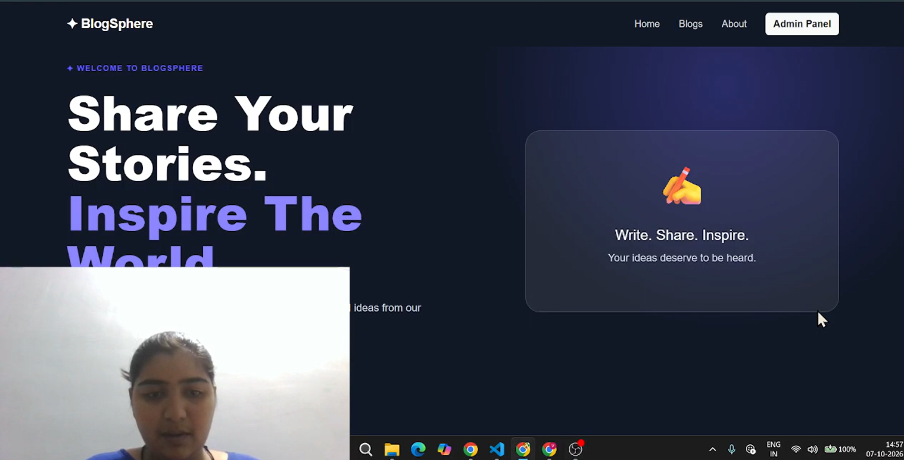

# 📝 Blog Management System

## 💻 React Blog Management System

BlogSphere is a modern **Blog Management System** developed using React.js.  
The application allows users to explore, search, filter and read blogs, while administrators can manage blog records using complete CRUD operations.

This project was created as a practical React assignment to demonstrate the use of **React Components, React Router, Hooks, Redux Toolkit, Axios, JSON Server, Forms, CRUD Operations, Searching, Sorting, Filtering and Pagination**.

---

## 🎥 Project Explanation Video

### ▶️ Click the thumbnail below to watch the complete project explanation

**Click the thumbnail above to open the project explanation video on Google Drive.**

---

## 📌 Project Description

BlogSphere is a React-based Blog Management System designed to provide two main experiences:

### 👤 User Side
Users can:

- View available blogs
- Search blogs by title or author
- Filter blogs by category
- Sort blogs by latest and oldest date
- Sort blogs alphabetically A-Z and Z-A
- Open complete blog details
- Navigate through blogs using pagination

### 👨‍💼 Admin Side
Administrators can:

- View the admin dashboard
- See total blog count
- See published blog count
- See draft blog count
- Add new blogs
- Edit existing blogs
- Delete blogs
- Manage blog status
- View all blog records

---

## ✨ Features

- ✅ React.js based application
- ✅ Reusable React components
- ✅ React Router navigation
- ✅ Add Blog functionality
- ✅ Edit Blog functionality
- ✅ Delete Blog functionality
- ✅ Complete CRUD operations
- ✅ Redux Toolkit state management
- ✅ Axios API integration
- ✅ JSON Server backend
- ✅ Search functionality
- ✅ Category filtering
- ✅ Sorting functionality
- ✅ Pagination
- ✅ Form validation
- ✅ Published/Draft status
- ✅ Responsive UI
- ✅ Bootstrap styling
- ✅ Blog details page
- ✅ Admin dashboard

---

## 🔄 CRUD Operations

The application implements complete CRUD functionality.

### ➕ Create

The administrator can add a new blog using the **Add New Blog** form.

The form contains:

- Blog Title
- Author
- Email
- Category
- Image URL
- Short Description
- Content
- Tags
- Publish Date
- Status

---

### 👁️ Read

Users can view all available blogs on the **Blogs** page.

They can also open an individual blog to view its complete details.

---

### ✏️ Update

Administrators can edit an existing blog from the **Admin Dashboard**.

The existing blog information is loaded into the form and can be updated.

---

### 🗑️ Delete

Administrators can delete a blog from the dashboard.

A confirmation message is displayed before deleting the blog.

---

## 🔍 Search, Filter & Sort

The Blogs page provides:

### Search

Search blogs by:

- Blog Title
- Author

### Filter

Blogs can be filtered by category.

### Sort

Blogs can be sorted using:

- Latest First
- Oldest First
- A-Z
- Z-A

---

## 📄 Pagination

Blogs are displayed using pagination to improve the user experience.

The application displays a limited number of blogs per page and provides navigation controls to move between pages.

---

## 📊 Admin Dashboard

The Admin Dashboard provides an overview of the blog records.

It displays:

| Statistic | Description |
|---|---|
| Total Blogs | Total number of blog records |
| Published | Number of published blogs |
| Drafts | Number of draft blogs |

The dashboard also provides:

- Add Blog
- Edit Blog
- Delete Blog

---

## 🛣️ Application Routes

| Route | Page |
|---|---|
| `/` | Home |
| `/blogs` | Blog List |
| `/blogs/:id` | Blog Details |
| `/admin` | Admin Dashboard |
| `/admin/add-blog` | Add Blog |
| `/admin/edit/:id` | Edit Blog |

---

## 🧩 Reusable Components

The project uses reusable React components such as:

- Header
- Footer
- BlogCard
- BlogList
- BlogForm
- SearchBar
- Pagination

This makes the application modular and easier to maintain.

---

## 🗂️ Project Structure

``text
Blog-project/
│
├── public/
│
├── Output/
│   └── Thumbnail.png
│
├── src/
│   │
│   ├── assets/
│   │
│   ├── Components/
│   │   ├── Header.jsx
│   │   ├── Footer.jsx
│   │   ├── BlogCard.jsx
│   │   ├── BlogForm.jsx
│   │   ├── BlogList.jsx
│   │   ├── SearchBar.jsx
│   │   └── Pagination.jsx
│   │
│   ├── pages/
│   │   ├── Home.jsx
│   │   ├── Blogs.jsx
│   │   ├── Blogdetails.jsx
│   │   │
│   │   └── admin/
│   │       ├── Dashboard.jsx
│   │       ├── AddBlog.jsx
│   │       └── EditBlog.jsx
│   │
│   ├── redux/
│   │   ├── store.js
│   │   └── blogSlice.js
│   │
│   ├── App.jsx
│   ├── App.css
│   ├── index.css
│   └── main.jsx
│
├── db.json
├── index.html
├── package.json
├── package-lock.json
├── vite.config.js
└── README.md

