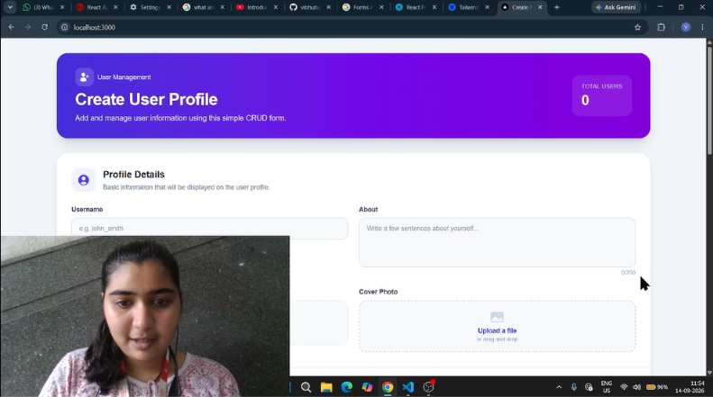

## 📂 Project Structure

```text
form-app/
│
├── app/
│   ├── Components/
│   │   └── Form.tsx
│   │
│   ├── favicon.ico
│   ├── globals.css
│   ├── layout.tsx
│   └── page.tsx
│
├── public/
│
├── .gitignore
├── AGENTS.md
├── CLAUDE.md
├── eslint.config.mjs
├── next-env.d.ts
├── next.config.ts
├── package-lock.json
├── package.json
├── postcss.config.mjs
├── README.md
└── tsconfig.json 

readme  🧑‍💻 User Registration & Management System

A user registration and management application developed using **Next.js, React, TypeScript and Tailwind CSS**.

The project provides a complete form-based CRUD workflow where users can be added, viewed, searched, sorted, edited and deleted. Form validation and browser `localStorage` are used to manage the records on the client side.

---

## 🎥 Project Explanation Video

### ▶️ Watch My Next.js Project Explanation

<a href="https://drive.google.com/file/d/1xRhcPUmbju2-OMVDdQ3bJ3AnaN_fnALm/view?usp=sharing" target="_blank">

    

**Click on the thumbnail above to watch my complete project explanation video.**

🎬 In this video, I explain my Next.js project structure, React components, form validation, CRUD operations, localStorage, search, sorting, pagination, UI design and the overall working of the application.

> **Important:** The project explanation video is hosted on Google Drive and shared as **Anyone with the link → Viewer** so that the evaluator can watch it without requesting access.

## 📌 Summary

This project is a **User Registration & Management System** created as a Next.js application. It contains a detailed registration form for collecting user information such as username, about information, name, email, password, gender, hobbies, country and address details.

The project also includes client-side validation, search functionality, sorting and pagination. User records are stored in the browser's `localStorage`, allowing the data to remain available after refreshing the page.

## 🛠️ Technologies Used

- **Next.js**
- **React.js**
- **TypeScript**
- **Tailwind CSS**
- **Heroicons**
- **HTML5**
- **CSS3**
- **Browser localStorage**
- **Git**
- **GitHub**

---

## ⚛️ Next.js / React Concepts Used

This project demonstrates the following concepts:

- Next.js App Router
- `page.tsx` for the application page
- `layout.tsx` for the root layout and metadata
- Client Components using `"use client"`
- Functional React Components
- JSX / TSX
- Component import and export
- `useState` for form and application state
- `useEffect` for loading saved data
- Controlled form inputs
- Form event handling
- Conditional rendering
- Array methods such as `filter()`, `map()` and `sort()`
- Client-side form validation
- Browser `localStorage`
- Search and filtering
- Sorting in ascending and descending order
- Pagination
- TypeScript interfaces and type definitions
- Tailwind CSS utility classes 