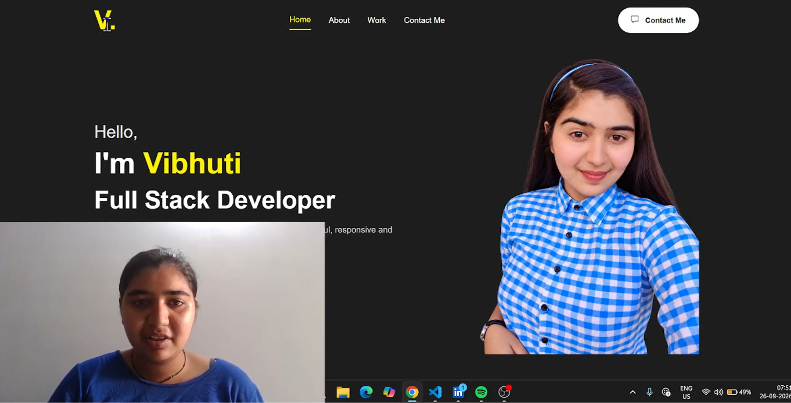

readme = r"""# 💼 Vibhuti Gadhvi - Personal Portfolio



A modern, responsive and professional **Personal Portfolio Website** developed using **React.js and Vite**.

This portfolio presents my profile, skills, services, projects and contact information through a clean and interactive user interface. The website uses a dark theme with yellow highlights to create a modern developer portfolio design.

---

## 🌐 Live Project

This project is developed using **React.js + Vite** and can be run locally using the Vite development server.

---

## 🎥 Project Explanation Video

### ▶️ Watch My Portfolio Project Explanation

[](https://drive.google.com/file/d/1dTX38pEamUhTOddmaV2rH-xbff1aaHSo/view?usp=sharing)

**Click on the thumbnail above to watch my complete project explanation video.**

> 🎬 In this video, I explain the ReactJS project structure, components, JSX, CSS styling, navigation, portfolio projects, contact form and the overall functionality of the website.

**Important:** The Google Drive video must be shared as **Anyone with the link → Viewer** so that the evaluator can watch it without requesting access.

---
## Summary 

portfolio project consisting of multiple components designed according to assigned requirements. The project structure includes a header, slider, work section, contact section, and a footer, utilizing various components.

Key features and sections of the portfolio include:
Header Section: Features a logo and navigation links, with a yellow hover effect applied to the "contact me" option.
Slider Section: Displays the speaker's photo, an H1 heading, a brief introduction, and a custom-colored button.

---

## 🛠️ Technologies Used

- **React.js**
- **JavaScript (JSX)**
- **HTML5**
- **CSS3**
- **Vite**
- **Git & GitHub**

---

## ⚛️ ReactJS Concepts Used

This project demonstrates the following React concepts:

- Functional Components
- JSX
- Component Import and Export
- Component-based Architecture
- Rendering Components through `App.jsx`
- Reusable UI structure
- Working with public assets
- Event and link handling
- Form elements
- CSS styling with React components

---

## 📁 Project Structure

```text
Portfolio/
│
├── public/
│   ├── Favicon.png
│   ├── My-banner-img.jpeg
│   ├── Me.png
│   ├── message.png
│   ├── pet-shop.png
│   ├── Programmings.png
│   ├── Twitter.png
│   ├── web-design.png
│   ├── youtube.png
│   └── ...other images
│
├── src/
│   │
│   ├── assets/
│   │
│   ├── Components/
│   │   ├── Header.jsx
│   │   ├── Slider.jsx
│   │   ├── Work.jsx
│   │   ├── Portfolio.jsx
│   │   ├── Contact.jsx
│   │   └── Footer.jsx
│   │
│   ├── App.jsx
│   ├── App.css
│   ├── index.css
│   └── main.jsx
│
├── Output/
│   ├── Output1.png
│   ├── Output2.png
│   ├── Output3.png
│   ├── Output4.png
│   ├── Output5.png
│   └── Thumbnail.png
│
├── .gitignore
├── eslint.config.js
├── index.html
├── package.json
├── package-lock.json
├── README.md
└── vite.config.js