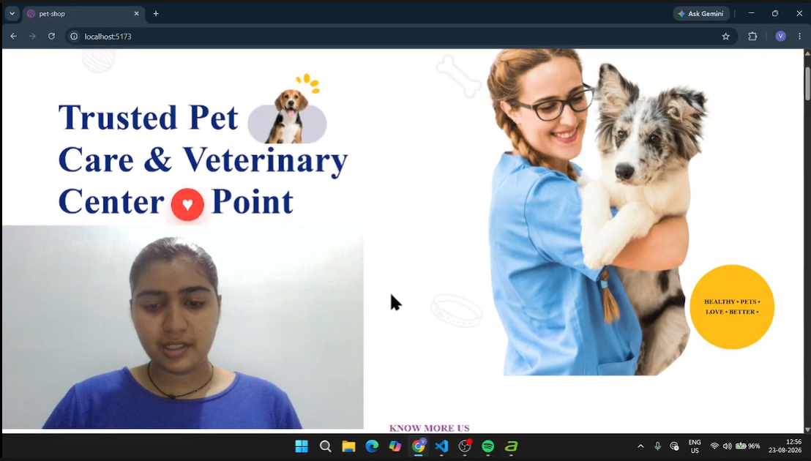

# Pet-shop Project

# PetPal – Pet Care Center | Practical Assignment

React.js practical project based on a Pet Care Center website. PetPal is a responsive pet-care website developed using React.js, JSX, JavaScript and CSS with a component-based architecture.

The website provides information about pet-care services, introduces the pet-care team, displays customer reviews, provides a schedule-a-visit section, presents pet-care news and blogs, and includes an Instagram section and detailed footer.

## 📁 Project Structure

pet-shop/
├── public/
│   └── Images/
│       └── Project images and assets
│
├── src/
│   ├── assets/
│   │
│   ├── Components/
│   │   ├── AboutUs.jsx
│   │   ├── AllServices.jsx
│   │   ├── FollowInsta.jsx
│   │   ├── Footer.jsx
│   │   ├── Header.jsx
│   │   ├── HeroBanner.jsx
│   │   ├── NewsBlogs.jsx
│   │   ├── OurTeam.jsx
│   │   ├── Priority.jsx
│   │   ├── Reviews.jsx
│   │   ├── Schedule.jsx
│   │   └── WeAreBest.jsx
│   │
│   ├── App.jsx
│   ├── App.css
│   ├── index.css
│   └── main.jsx
│
├── Output/
│   ├── Homepage.png
│   ├── AboutUs.png
│   ├── Services.png
│   ├── Priority.png
│   ├── OurTeam.png
│   ├── Reviews.png
│   ├── Schedule.png
│   ├── NewsBlogs.png
│   ├── FollowInsta.png
│   ├── WeAreBest.png
│   ├── Footer.png
│   └── thumbnail.png
│
├── index.html 
├── package.json
├── package-lock.json
└── vite.config.js

## 🛠️ Tech Stack

| Technology | Usage |
|---|---|
| React.js | Component-based UI development |
| Vite | Development environment and build tool |
| JSX | Building React UI components |
| JavaScript | Application logic and data handling |
| CSS | Styling and responsive layout |
| Font Awesome | Social-media and interface icons |
| HTML5 | Page structure |
| Responsive Design | Responsive website layout |

### Project Video

 [PetPal Video Explanation](https://drive.google.com/file/d/1NS10YJ44jctlchn3tlnMLxmi6CYxrxqc/view?usp=sharing)

 ### Thumbnail :- 
  
 

### Student Details

**Name of the Developer is :** Vibhuti Gadhvi  

---
